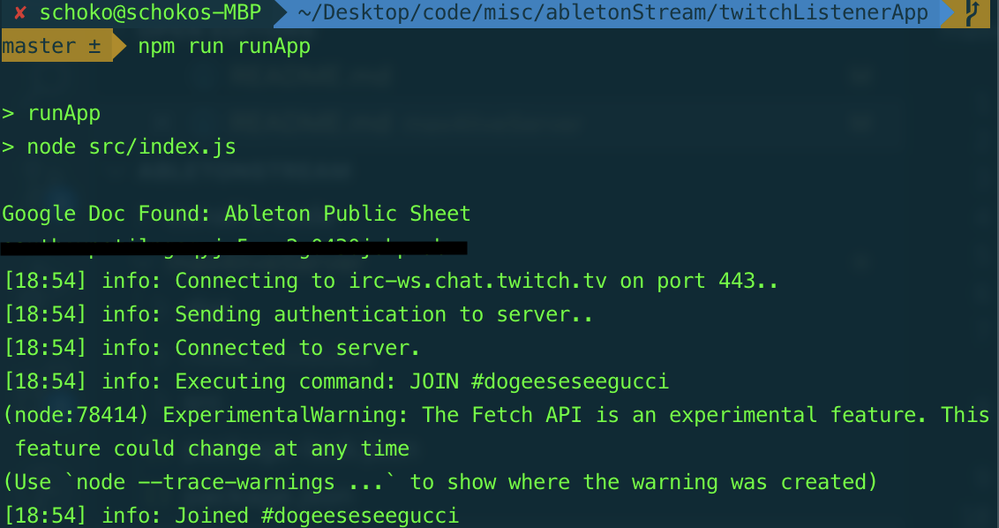

# twitchListenerApp

## Summary

The real meat is here. This parses the rules from our google sheet, and listens for twitch messages, then posts them to the max4live server.

## How It Works

1. Pulls in this [G sheet](https://docs.google.com/spreadsheets/d/1DNoENT4H-c4KjjNYWnegUOXIIrvo3ZamlwGlfm0U3Ss/edit#gid=0)
2. Takes all keywords, splits them by a comma and space, and lowercases them all
3. Creates a key value map where 1 key keyword points to an action (i.e "vibes" => "dorian, slower)
4. Then we'll integrate your twitch code, which will turn the whole chat message into lowercase, and look for trigger Keywords in the message
5. If there are 1 (or multiple) matches, the most low down on the Google Sheet is passed to Max4live.

## Running

```bash
# 1. Create an empty file '.env' in this directory
# 2. Copy the '.env file' section from here into the '.env' file with the proper keys.
npm install
npm run runApp
```

## Working example



## .env file

```
GOOGLE_API_KEY=xxxx
TWITCH_TOKEN=oauth:xxxx
```
